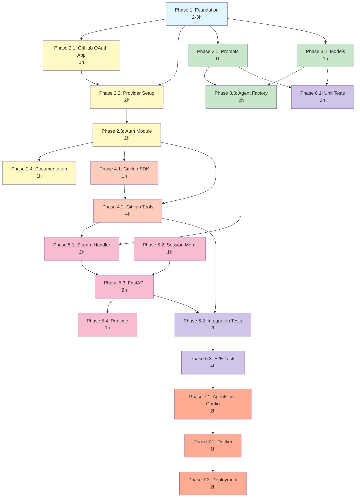
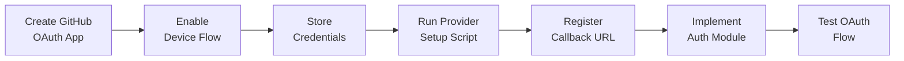
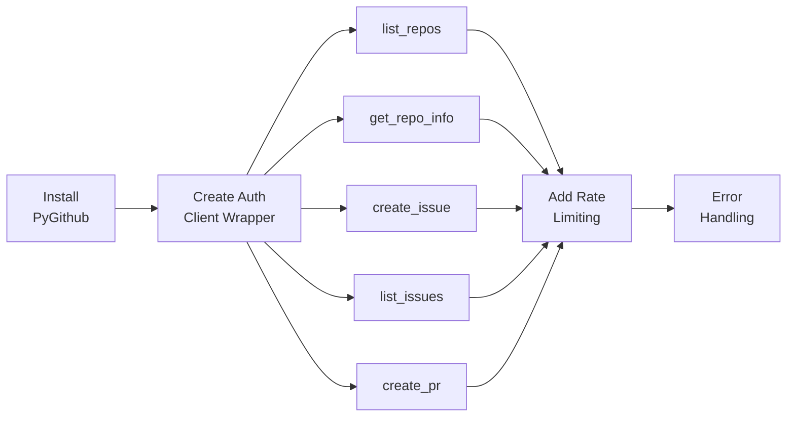
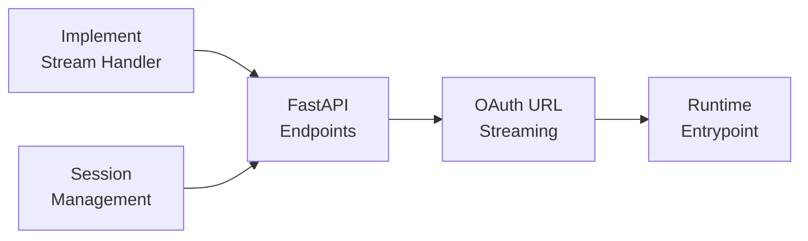

# Implementation Dependency Graph

## Phase Dependencies (Mermaid Diagram)



## Critical Paths

### Path 1: OAuth Infrastructure (13 hours)
```
Phase 1 (3h)
  → Phase 2.1 (1h)
    → Phase 2.2 (2h)
      → Phase 2.3 (2h)
        → Phase 4.2 (4h)
          → Phase 6.2 (1h)
```

### Path 2: Agent Development (13 hours)
```
Phase 1 (3h)
  → Phase 3.1 (1h)
    → Phase 3.3 (2h)
      → Phase 5.1 (2h)
        → Phase 5.3 (2h)
          → Phase 6.3 (3h)
```

### Path 3: Testing to Deployment (13 hours)
```
Phase 6.3 (4h)
  → Phase 7.1 (2h)
    → Phase 7.2 (1h)
      → Phase 7.3 (2h)
```

## Parallel Execution Opportunities

### Batch 1: After Phase 1 (3 tasks can run in parallel)
```
Phase 1 (3h) ─┬─→ Phase 2.1: GitHub OAuth App (1h)
              ├─→ Phase 3.1: Prompts (1h)
              └─→ Phase 3.2: Models (1h)
```
**Sequential:** 6 hours | **Parallel:** 4 hours | **Saved:** 2 hours

### Batch 2: After Phase 2.2 (2 tasks can run in parallel)
```
Phase 2.2 (2h) ─┬─→ Phase 2.3: Auth Module (2h)
                └─→ Phase 4.1: GitHub SDK (1h)
```
**Sequential:** 3 hours | **Parallel:** 2 hours | **Saved:** 1 hour

### Batch 3: After Phase 3.3 & 4.2 (3 tasks can run in parallel)
```
Phase 3.3 & 4.2 ─┬─→ Phase 5.1: Stream Handler (2h)
                 ├─→ Phase 5.2: Session Mgmt (1h)
                 └─→ Phase 6.1: Unit Tests (2h)
```
**Sequential:** 5 hours | **Parallel:** 2 hours | **Saved:** 3 hours

### Batch 4: Testing Phase (partial parallel)
```
Phase 5.3 ─┬─→ Phase 6.1: Unit Tests (2h)
           └─→ Phase 6.2: Integration Tests (2h)
                └─→ Phase 6.3: E2E Tests (4h)
```
**Sequential:** 8 hours | **Parallel:** 6 hours | **Saved:** 2 hours

## Task-Level Dependencies

### Phase 2: OAuth Infrastructure


### Phase 4: GitHub Integration


### Phase 5: Streaming Chat


## Resource Allocation

### Single Developer Timeline

| Week | Phase | Hours | Cumulative |
|------|-------|-------|------------|
| Week 1 | Phase 1-2 | 10h | 10h |
| Week 2 | Phase 3-4 | 12h | 22h |
| Week 3 | Phase 5-6 | 14h | 36h |
| Week 4 | Phase 7 | 5h | 41h |

**Total:** ~40 hours (1 week full-time or 2 weeks part-time)

### Two Developer Timeline (Parallel)

| Developer | Focus | Hours |
|-----------|-------|-------|
| Dev 1 | OAuth + GitHub Tools | 18h |
| Dev 2 | Agent + Streaming | 16h |
| Both | Testing + Deployment | 10h |

**Total:** ~26 hours (3-4 days with 2 developers)

### Three Developer Timeline (Maximum Parallel)

| Developer | Focus | Hours |
|-----------|-------|-------|
| Dev 1 | OAuth Infrastructure | 10h |
| Dev 2 | Agent + Prompts + Models | 8h |
| Dev 3 | GitHub Tools + Streaming | 12h |
| All | Integration + Testing | 8h |

**Total:** ~18 hours (2-3 days with 3 developers)

## Dependency Matrix

| Phase | Depends On | Blocks | Can Parallel With |
|-------|------------|--------|-------------------|
| P1 | None | All | - |
| P2.1 | P1 | P2.2 | P3.1, P3.2 |
| P2.2 | P2.1 | P2.3, P4 | P3.1, P3.2 |
| P2.3 | P2.2 | P4 | P4.1 |
| P2.4 | P2.3 | - | P3.3, P4.1 |
| P3.1 | P1 | P3.3 | P2.1, P2.2, P3.2 |
| P3.2 | P1 | P3.3 | P2.1, P2.2, P3.1 |
| P3.3 | P3.1, P3.2 | P5 | P2.3, P2.4 |
| P4.1 | P2.3 | P4.2 | P2.4, P3.3 |
| P4.2 | P4.1, P2.3 | P5, P6.2 | - |
| P5.1 | P3.3, P4.2 | P5.3 | P5.2, P6.1 |
| P5.2 | - | P5.3 | P5.1, P6.1 |
| P5.3 | P5.1, P5.2 | P5.4, P6.2 | P6.1 |
| P5.4 | P5.3 | P7 | P6.1, P6.2 |
| P6.1 | P3.2 | P6.2 | P5.1, P5.2 |
| P6.2 | P4.2, P5.3 | P6.3 | - |
| P6.3 | P6.2 | P7 | - |
| P7.1 | P6.3 | P7.2 | - |
| P7.2 | P7.1 | P7.3 | - |
| P7.3 | P7.2 | - | - |

## Gantt Chart (Sequential vs Parallel)

### Sequential Execution (36 hours)
```
Day 1  [==P1==][==P2.1==][==P2.2==]
Day 2  [====P2.3====][===P2.4===]
Day 3  [==P3.1==][==P3.2==][====P3.3====]
Day 4  [==P4.1==][========P4.2========]
Day 5  [====P5.1====][=P5.2=][====P5.3====]
Day 6  [==P5.4==][========P6.1========]
Day 7  [========P6.2========][==========P6.3==========]
Day 8  [======P7.1======][=P7.2=][======P7.3======]
```

### Parallel Execution (26 hours)
```
Day 1  [==P1==][==P2.1==|==P3.1==|==P3.2==]
Day 2  [==P2.2==][=P2.3=|=P4.1=][===P2.4===]
Day 3  [====P3.3====][========P4.2========]
Day 4  [===P5.1===|=P5.2=|=P6.1=][====P5.3====]
Day 5  [==P5.4==][===P6.2===][=====P6.3=====]
Day 6  [===P7.1===][P7.2][===P7.3===]
```

**Legend:**
- `|` = Parallel execution
- `[===]` = Task duration

## Risk-Weighted Critical Path

Taking into account probability and impact of delays:

### High-Risk Tasks (Must Monitor Closely)
1. **Phase 2.2: OAuth Provider Setup** (2h base + 2h risk buffer)
   - Risk: Callback URL issues, AWS permissions
   - Buffer: 100% (2 hours)

2. **Phase 4.2: GitHub Tools** (4h base + 2h risk buffer)
   - Risk: API rate limits, token issues
   - Buffer: 50% (2 hours)

3. **Phase 6.3: E2E Testing** (4h base + 4h risk buffer)
   - Risk: OAuth flow issues, integration failures
   - Buffer: 100% (4 hours)

### Adjusted Timeline with Risk Buffer

**Optimistic:** 26 hours
**Realistic:** 34 hours (with 8h risk buffer)
**Pessimistic:** 44 hours (with 18h risk buffer)

**Recommendation:** Plan for 34-36 hours (realistic scenario)

## Milestone Checkpoints

### Milestone 1: Foundation Complete (End of Day 1)
- ✓ Project structure established
- ✓ OAuth provider created
- ✓ Callback URL registered
**Confidence:** Should be achievable

### Milestone 2: Core Features Complete (End of Day 3)
- ✓ Agent can be created
- ✓ GitHub tools working
- ✓ OAuth flow tested
**Confidence:** Medium (depends on OAuth setup)

### Milestone 3: Integration Complete (End of Day 5)
- ✓ Streaming chat functional
- ✓ All tests passing
- ✓ Ready for deployment
**Confidence:** High (if Milestone 2 achieved)

### Milestone 4: Production Ready (End of Day 6)
- ✓ Deployed to AgentCore
- ✓ Live OAuth tested
- ✓ Documentation complete
**Confidence:** High (if testing thorough)

## Dependencies External to Project

### AWS Resources Required
- [ ] AWS Account with Bedrock access
- [ ] IAM permissions for bedrock-agentcore-control
- [ ] CloudWatch Logs access
- [ ] AgentCore Runtime quotas

### GitHub Requirements
- [ ] GitHub account
- [ ] Developer access to create OAuth Apps
- [ ] Test repository for validation

### Development Environment
- [ ] Python 3.11+
- [ ] uv or Poetry
- [ ] Docker
- [ ] AWS CLI configured
- [ ] agentcore CLI installed

**Estimated Setup Time:** 2-3 hours (not included in main timeline)

---

**Conclusion:**
- **Fastest possible:** 18 hours (3 developers, perfect execution)
- **Realistic solo:** 34-36 hours (1 week with risk buffer)
- **Team of 2:** 26-28 hours (4-5 days)
- **Recommended approach:** Solo developer over 1 week, focusing on critical path phases first
